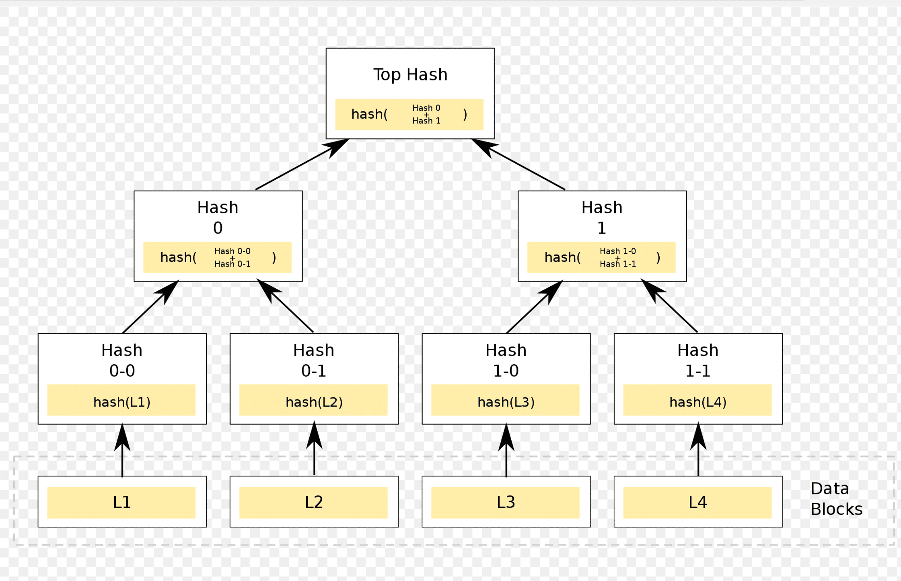

<section>

  <section>
    <h1>The road to 10m tx/sec⚡️</h1>
  </section>

  <section>
  
How can we trust a settlement of some value?

  
By verifying the transactions!

  <aside class="notes">
  
The first whitepaper a.k.a. constitution was written in the late 18th century

  
One of the core innovation was the concept of the separation of powers

  
It was a system of checks and balances

  </aside>
  </section>

  <section>
  
To achieve this we have historically invested a huge amount in "social capital"

  <ul>
    <li>Banks</li>
    <li>Regulators</li>
    <li>Accountants</li>
    <li>Lawyers</li>
  </ul>

  
... all of whom stand on the shoulders of giants

  </section>

  <section data-background-color="rgb(241, 239, 238)">
  
  </section>

  <section data-background-image="paper-trade.jpg" data-background-opacity="0.5">
  
Until 1968 Wall Street was drowning in paper from a surge in trading, which caused the exchange to close often on Wednesdays to settle trades.

  
> 0.05 tx/sec

  <aside class="notes">
A turmoil around the number of couriers required to carry bags of checks and stock certificates caused a paper crunch and the exchange to extend the settlement period to five days

Wall Street began to envision a more efficient settlement process led by electronic means. Then in 2001, the attacks of 9/11 further proved the vulnerability of paper stock certificates, when vaults of them incinerated with the demolition of the World Trade Cent
  </aside>
  </section>

  <section data-background-image="paper-trade.jpg" data-background-opacity="0.5">
  
Later trades would be recorded and settling electronically solving most of the scaling problems

  
> 100,000-1,000,000 tx/sec

  
... but settlement latency is often 3 days

  </section>

</section>

<section>

  <section data-background-color="rgb(0, 39, 118)">
  Since 2009 another way to achieve the same result has been to perform verifiable computation
  
> 10 tx/sec

  </section>

  <section data-background-color="rgb(0, 39, 118)">

  </section>

  <section data-background-color="rgb(219, 227, 241)">

  </section>

  <section data-background-color="rgb(20, 32, 43)">

  </section>

  <section data-background-color="rgb(0, 39, 118)">

| Chain         | Nodes   |
|---------------|---------|
| Ethereum 2.0  | 238,099 |
| Cardano       | 2,076   |
| Avalanche     | 1,023   |
| Tezos         | 377     |
| Polkadot      | 297     |
| Cosmos Hub    | 150     |
| Nano          | 107     |

  </section>

</section>

<section>
  <section data-background-color="mediumseagreen">
T✌️ o ways this evolves

<ol>
<li>Interchain</li>
<ul>
  <li>Multiple L1s with bridges</li>
  <li>Current bridges are a security risk</li>
  <li>Better design will translate consensus data</li>
  <li>IBC interchain accounts</li>
</ul>
<li>Multichain</li>
<ul>
<li>Rollups</li>
<li>Shared security</li>
</ul>
</ol>

... or more likely a linear combination of those two

  </section>
  <section data-background-color="mediumseagreen">
Specialization reverses the blockchain trilemma

Consensus 🤝

Execution 🧠

Data availability 💾

  </section>
  <section data-background-color="mediumseagreen">
  <h4>Consensus 🤝</h4>

  <ul>
    <li>Ordering of transactions</li>
    <li>Executing settlement logic</li>
    <li>Decentralization matters</li>
  </ul>
  
> 100 tx/sec

  </section>
  <section data-background-color="mediumseagreen">
   <h4>Execution 🧠</h4>

  <ul>
    <li>Single operator without compromising on security</li>
    <li>Optimistic rollups with fraud proofs</li>
    <li>Zero-knowledge rollups with validity proofs</li>
  </ul>
  
> 10,000 tx/sec

  
100 * 10,000 = 1,000,000 tx/sec

  </section>
  <section data-background-color="mediumseagreen">
   <h4>Data availability 💾</h4>

  <ul>
    <li>Data sharding</li>
    <li>Initially 16 shards</li>
    <li>Scaling up to 1024 shards</li>
    </li>
  </ul>
  
>30% cost reduction

  </section>

</section>

<section>

  <section data-background-color="crimson">
  Rollups (L2)

  
  </section>

  <section data-background-color="crimson">
  Merkle tree

  
  </section>

  <section data-background-color="crimson">
Zero-knowledge Rollups

- Cross-rollup communication
- Shared state, including liquidity
- Security guarantees
- zkEVM

  </section>

  <section data-background-color="crimson">
zkEVM on L1

  Running on mobile phones and in browsers
  
>70% cost reduction

  </section>

  <section>
  Now we just need an unforeseen 10x in throughput and then we're up to <b>10 million transactions per second</b> with a settlement latency of a few seconds for next to nothing 🤔
  </section>
</section>
